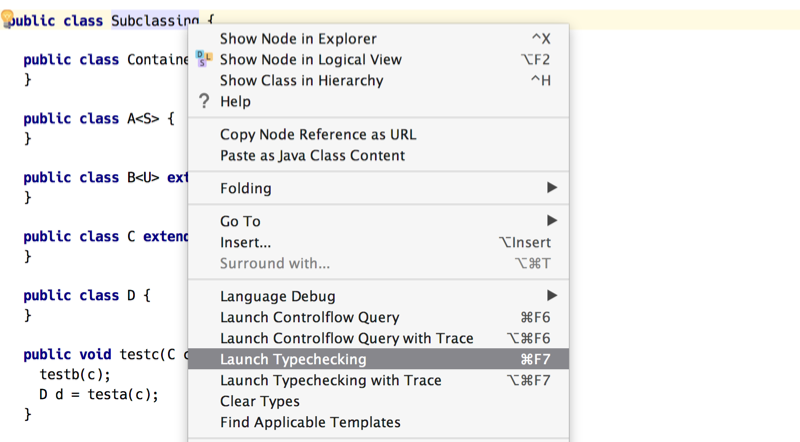
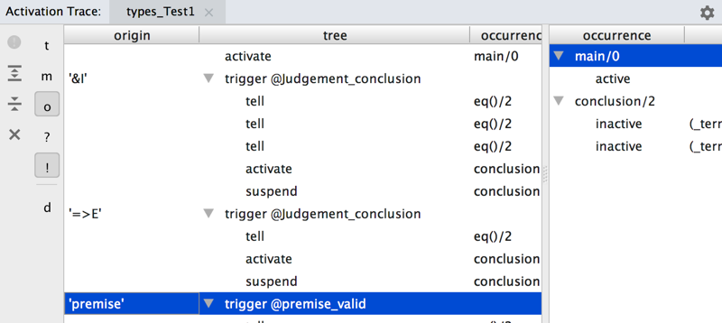

# Evaluating Code Rules

The process of evaluating code rules consists of two stages:

1. Collecting handlers and applying rules.
2. Processing constraint productions collected in the first stage.

Stage one is executed in the background in a read action, and is expected to finish quickly. Stage two is executed on a worker thread and does not require reads or writes. After the second stage is finished there is a short write action which «publishes» collected types.

### Applying rules

The first stage of evaluating code rules begins with collecting handlers. Handlers are collected from corresponding aspects of all languages imported into the model. In addition to that, all extended languages are also included into the scope.

All handlers collected in the previous step are sorted, so that the ones coming from extensions appear earlier. This sorting order ensures that when productions are selected to match an active constraint, the productions coming from extensions will have higher priority.

After the relevant handlers are collected, the source model is traversed from the specified location, and the applicable rules are evaluated. As rules are applied, they produce constraint productions. As well as generating constraint productions, the rules are allowed to report messages to be displayed at source locations.

Generated constraint productions constitute the constraints program, which is then executed in the next stage.

### Executing constraints program

In the second stage the constraints program is executed.

To begin execution, a *query* is selected, which contains the list of constraints to be activated. Query can be viewed as a regular production, which is triggered unconditionally, but no earlier than all headless productions (marked as «on start») have fired.

There is a fixed order in which productions are fired on start of program execution. First, all «on start» productions are triggered. All constraints activated by these productions are processed normally, and after there are no more productions to be triggered, the query is fired.

Order of productions fired:
1. «on start» productions
2. query production

While constraints program is run, it is allowed to report feedback, such as assign calculated types or report problems, using special constructs, that are available as predicates in the body of production.

For example, type **node** can be assigned to source model location with *set type* operation. Essentially, assigning a type node can be understood as a way of annotating source model with additional information, which can then be reused by subsequent invocations of code rules or displayed to the user. 

  
_(example showing type assigned from a production)_

Failures during constraints program execution are caught with the help of alternative body branches, where those are provided. An uncaught failure terminates program execution and is reported to the user.

In the following example, a potential error is caught in the `else` branch and a corresponding errors is reported. Execution of constraints program is not terminated though, so other problems may still be reported. 

  
_(example of using an alternative body branch)_

### User interface

The user interface is defined by a plugin responsible for particular language aspect. 

  
_(context menu with typechecking actions)_

### Activation trace view

During execution of a constraints program all activation/suspension/deactivation events, as well as ask/tell queries to predicates can be displayed in a dedicated view.

  
_(sample proof in propositional logic)_

Above is an example of a proof in propositional logic, the trace of checking which is provided below. When a row in the left pane side selected, the right pane displays the contents of *constraints store* at this moment in time. 

  
_(activation trace view)_

