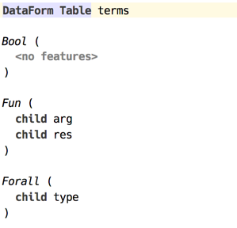
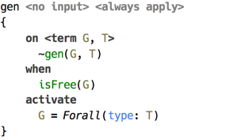
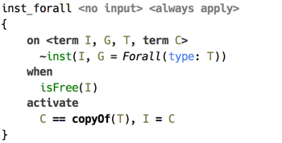
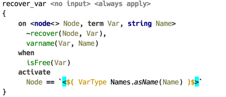
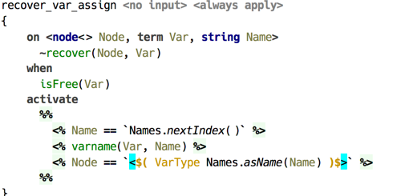

# Typechecking STLC

Simply Typed Lambda Calculus is a famous example favoured by textbook authors. This sample demonstrates how a classical type checking algorithm (Hindley-Milner[^hm]) designed specifically for this language can be implemented using code rules. This sample has also been demonstrated in an article[^tclc] published online.

For purposes of keeping this sample small, we keep the language confined to boolean values. Aside of boolean constants `true` and `false`, the mandatory lambda abstraction and application, `let-in` expression, and `if-then-else`, we have in addition defined `fix` operator to support recursion.

The dataform table contains obvious declarations for the only primitive type `bool`, the functional `fun` type, and universal type `forall`. The macros table responsible for constructing dataform instances is trivial.

  
_(dataform table)_

There is only one query of kind `TYPECHECK`, which launches types recovery. All the type checking is done by the automatic productions «on start». 

Handlers are separated into types recovery, operations with universal type, and the rest, which is assigning types to expressions. Type checking follows the program’s syntactic structure.

  
_(typing rule for lambda variable binding)_

A variable introduced by lambda abstraction is assigned a type, which is a fresh  logical variable.

  
_(typing rule for lambda abstration)_

A lambda expression is assigned a function type. This rule is a direct translation of the theoretic rule for lambda abstraction. 

  
_(typing rule for application expression)_

Similarly, the type of an application expression is pretty much follows the standard textbook form with a notable addition of the `else` branch: this is the way errors are caught in case unification fails. Here, `inst` constraint ensures a universal type is unwrapped and the inner type dataform is copied, so that all free variables in the resulting type are fresh.

  
_(typing rule for if-then-else)_

The type checking for `if-then-else` ensures that the types of both branches unify, and assigns the resulting unified type to the whole expression.

  
_(typing rule for fix operator)_

Finally, the `fix` operator, which represents general recursion, is given the type `forall.(a -> a) -> a`. 

A separate handler is dedicated to producing and instantiating universal type instances, which are represented by `Forall()` dataform. 

  
_(rule producing forall type)_

This production assigns the output parameter `G` a new type universal type wrapping the `T` parameter. 

  
_(rule instantiating forall type)_

The constraint `inst` is responsible for unwrapping (instantiating) an universal type. Here the `copyOf()` is a call to internal API, which makes a copy of the term passed as parameter, ensuring all logical variables within it are replaced with fresh ones.  

The handler `recover` is responsible for translating the calculated types to `SNode` form and is pretty straightforward. 

  
_(recover var type)_

The constraint `varname` is used to track the names of type variables, so that the resulting types have the form `t1`, `t2`, and so on.

  
_(recover var type assigning name)_

The above production ensures all free logical variables representing type variables are assigned unique name.

[^hm]: See for example: Cardelli, Luca. "Basic polymorphic typechecking." Science of computer programming 8.2 (1987): 147-172.
[^tclc]: Type Checking Lambda Calculus: [https://github.com/fisakov/typechecking-lambdacalc](https://github.com/fisakov/typechecking-lambdacalc)
