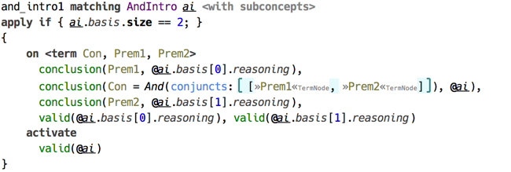

# Fitch Proof Validation

This example demonstrates the use of *code rules* to implement validation of logical proofs written using Fitch system. The idea of this implementation originates in the proof checking tool provided as part of an inroductory course on logic by Stanford University[^inlog]. This overview serves for quick introduction, and more detailed information can be found at project’s home page (see the link on top of this page).

The four languages in this example define the structure of proofs (samples.fitch), the structure of three kinds of logic: Propositional logic, Herbrand logic, and First Order logic (samples.fitch.*logic).

The proof structure allows for building hierarchical proof trees, which are necessary for Implication Introduction rule, and interprets the leafs as reasonings, which can be either assumptions or judgements. The beginning of the proof contains all the premises, and the final top-level node is the goal.

  
_(example of proof in Fitch system)_

Base inference rules are defined by `samples.fitch.propositionalLogic` language, with two other extending the set of rules appropriately. Herbrand logic extends this language with relations, functions, and quantifiers, whereas First Order logic adds equality. Each of the logics also define their own root proof concept.

The proof validation is done through type checking with the only type being “Ok”. There is one query of kind `TYPECHECKING`, which simply activates `checkAll()`. Every logical formula from reasonings is translated into a dataform, with logical variables taking place of quantifier variables.

Each reasoning has a *conclusion*, which is expanded to term and assigned to the source location with `conclusion()` constraint. In addition, at the start, all proof’s premises are marked as valid using `valid()`. The process then continues recursively, with every inference rule constructed according to a single pattern:
- the head ensures the conclusions of all rule’s *bases* (input premises) match the required form,
- the rule’s conclusion matches the required form, and
- all the bases are *valid*.

  
_(example of an inference rule)_

The rule’s body activates `valid()` constraint, therefore only reasonings that have met the requirement are marked as valid. Check handler marks reasonings that weren’t validated as erroneous.

Finally, if the proof’s goal is marked valid, it is assigned “Ok” type, otherwise it is marked with error.

[^inlog]: Stanford Introduction to Logic [http://logic.stanford.edu/intrologic/homepage/index.html](http://logic.stanford.edu/intrologic/homepage/index.html)
