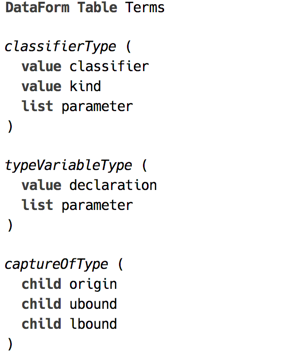
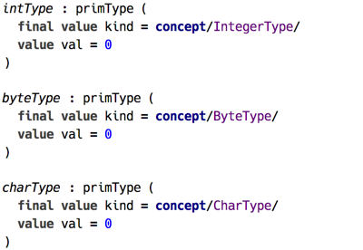
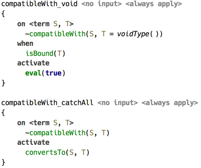

# Typechecking BaseLanguage

Short explanation of the architecture of BL-specific type system built with *code rules*.

This sample is the main result of developing code rules. It is still work in progress, but the main areas of type checking BaseLanguage have been covered. Here we briefly touch on the implementation details.

First, all the BaseLanguage types have corresponding dataforms, and in addition there are definitions of types that are only ever used during type checking, such as capture type.

The macros in `Types` macro table define the rules how types are constructed, ensuring, among other things, that bounds on type parameters are correctly processed.

  
_(examples of type dataforms)_

Primitive types define allowed ranges, so the dataforms for these types have value slots capturing literal’s value.

  
_(examples of primitive type dataforms)_

There are two queries defined for type checking and for converting a type to another type. The latter is used when testing for *subtyping*. ConvertsTo query expands both its parameters before activating `convertsTo()` constraint, which launches the processing of the relation.

  
_(the production from `ConvertsTo` query)_

  
_(the production from `Typecheck` query)_

Typechecking itself starts with activating the `checkAll()` constraint, triggering  the productions responsible for assigning types to literals, `this` expression, as well as processing type annotations — ensuring that these are built without violating bounds.

The rule for variable declaration is quite trivial: the type annotation gets expanded to dataform and assigned to the source location with `typeOf()` constraint.

  
_(assigning the type to a variable declaration)_

An integer literal is simply assigned the type `int` with the value being the value of literal.

  
_(assigning the type to `int` literal)_

From these starting points type checking continues up the syntax tree until there are no more productions left that can be triggered.

A `dot expression` propagates the type from operation to the whole expression.

  
_(typechecking of dot expression)_

Whereas `assignment` does something more: it ensures that the actual type on the right is compatible with the type on the left.

  
_(typechecking of assignment expression)_

### Type Relations

Several kinds of relations on types are defined, surveyed in the following table.

| Relation | Constraint | Description |
|:--|:--|:--|
| compatibility | `compatibleWith()` | generalisation of conversion to include void type |
| conversion | `convertsTo()` | generalisation of subtyping, LSP |
| primitive subtyping | `primSubtype()` | subtyping among primitive types |
| subclassing | `promote()` | subtyping among classifier types |
| containment | `containedIn()` | type parameter containment |

#### Conversion

Constraint `convertsTo()` ensures that a type can be converted to another type, that is a type A can be used instead of type B. To test if a type is acceptable in certain locations, including those that allow any type, the constraint `compatibleWith()` is used, which delegates to `convertsTo()`.

  
_(resolution of `compatibleWith()` via `convertsTo()`)_

In its turn, `convertsTo()` delegates to either `primSubtype()`, which is responsible for solving primitive subtyping, or to `promote()`, which focuses on subtyping of classifier types.

  
_(`convertsTo()` delegates to `promote()` for classifier type)_

#### Subclassing

Resolution of `promote()` constraint, which represents subtyping among classifier types, is implemented around a simple idea of representing all subclass paths the root (Object) to a classifier as a set of lists. This representation deliberately ignores the class parameters. As a first step, the shortest path from supertype’s classifier to subtype’s one is selected. This path is then reversed and represented as a dataform list. This makes it possible to pattern-match on this list, since it is nothing more than a cons list represented as a dataform.

Subtyping is a reflexive and transitive relation, so `promote()` is replaced with another constraint `dpromote()`, which triggers one of the two productions responsible for either aspect of the relation. Transitivity is solved by advancing up the supertype path keeping track of all type variables and ensuring all bounds on type parameter are satisfied. Reflexivity delegates to `containedIn()` to ensure parameters are within bounds, which in its turn delegates to `convertsTo()`.

Take a simple example of `Long` classifier type — the boxed `long`. Its superclasses are written as follows.

```
  Long : Comparable : Object
  Long : Number : Serializable : Object
```

Suppose we need to decide if `Long <: Serializable`, that is if `Long` is a subtype of `Serializable`. The shortest path between those consists of three nodes : `[Long, Number, Serializable]`. Constraint `dpromote()` is activated with this list as the  3rd parameter, and it requires two steps of inductive production and one step of reflexive to solve this relation.
