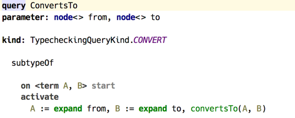
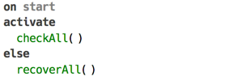

# Overview

Analysis of source code or model with *code rules* can be described as a two-phase process.

In the first phase, the languages used by the model being analysed, and their prototypes (meaning the languages that are being *extended*, but not used directly) are surveyed for the appropriate *code rules* aspect model, which is `types` in case of type checking, for example. Contents of this aspect model is a contribution of this particular language. All rules within this model are applied to the source model, with rules coming from extension languages having higher priority.

The outcome of this phase is a *constraints program*, which is a collection of *handlers*, which in turn represent lists of *productions*. This «program», however, exists in memory only, it does not have any textual representation. Aside from generating productions, the rules can also process the model normally, reporting errors as usual.

The first phase runs in «read action», therefore blocking potential writes, which means the editor may become unresponsive if a write action is requested. Ideally the rules should finish quickly and postpone all heavy load to the next phase, which can be run in the background, as the access to `SModel` is no longer necessary.

In the second phase the constraints program that was created in phase one is executed. Execution starts with a query, which serves as an entry point to the program. For example, type system defines `TYPECHECK` and `CONVERT` queries, aimed at running type checking and testing if a type can be converted to another type, correspondingly. Queries are declared in the same aspect model.

  
_(example of a query)_

In the above example, the query defines two logical variables (A and B) of type `term`, which serve to represent types internally. First, both query parameters `to` and `from` are *expanded*, meaning that their `SNode` representations are converted to terms, and then constraint `convertsTo(A, B)` is activated, kicking off the processing of constraints, which is the essence of constraints program execution. In case productions triggered by `convertsTo/2` constraint all evaluate to true, the query is deemed successful, and if there is at least one production that evaluates to false, the query fails accordingly.

One nice feature of using code rules is the ability to abstract away from type structure defined by the language. For example, one may decide to represent all primitive types as a term `primitive(kind=<specific kind>)`. Terms can also incorporate values as regular Java objects, so creating an inference rule which checks if a particular constant fits the given type, be it an `int` or a `char`, is trivial.  

Having an internal representation for types also means, that if type system is required to represent types as instances of `SNode` to the user, this has to be addressed by the query design. For instance, a type checking query may consist of two constraint activations:

  
_(example of a query production)_

Here, the first constraint `checkAll/0` fires type checking, whereas the second `recoverAll/0` is responsible for restoring terms to `SNode` instances and reporting them back to the user. Joining the two constraints with a conjunction establishes the order in which these are evaluated.

An of course, if something can go wrong, it will. In case type inference is unsuccessful, the second part of the query has no chance of being executed. To account for that, a partial backtracking was added to the language of constraint productions, which helps recover from certain failures.

  
_(example of a query production with alternative body)_

Here, `recoverAll/0` constraint is moved out to an «*alternative branch*» of production body, which allows it to be activated even if there was an error while processing the main branch.

To illustrate how automatic binding of logical variables work, consider the following example. Constraint `typeOf/2` associates a type with a location in source model, and `convertsTo/2` ensures its 1st argument can be converted to the 2nd, which must both be types.

  
_(example of rule with production)_

This production is triggered when both locations referred to by `ae.lValue` and `ae.rValue` have their types assigned, as both `typeOf/2` constraints must be present for a match to be successful. Once production’s head is matched, both logical variables `LType` and `RType` become bound to whatever was the 2nd argument of either occurrences of `typeOf/2` constraint.

It’s important to note, that although on successful match both `lValue` and `rValue` have types, it’s not guaranteed that these types are *ground*. A type may be represented by a free logical variable, or a term containing free variables. Another very important thing to notice is that a logical variable enjoys full privileges of being an argument to a constraint. Which means, if in the above example both variables are free, and `LType = RType`, then both locations will have essentially the *same* type (in the sense of «same instance»), not just matching types.

The following example illustrates the use of *pattern matching* in production’s head. Here the first argument to constraint `convertsTo/2` in the head is a logical variable with pattern expression. In this case the production will only be triggered if the active constraint’s first argument is *bound* (is not a free logical variable), and it matches the pattern.

  
_(example of rule with production)_
